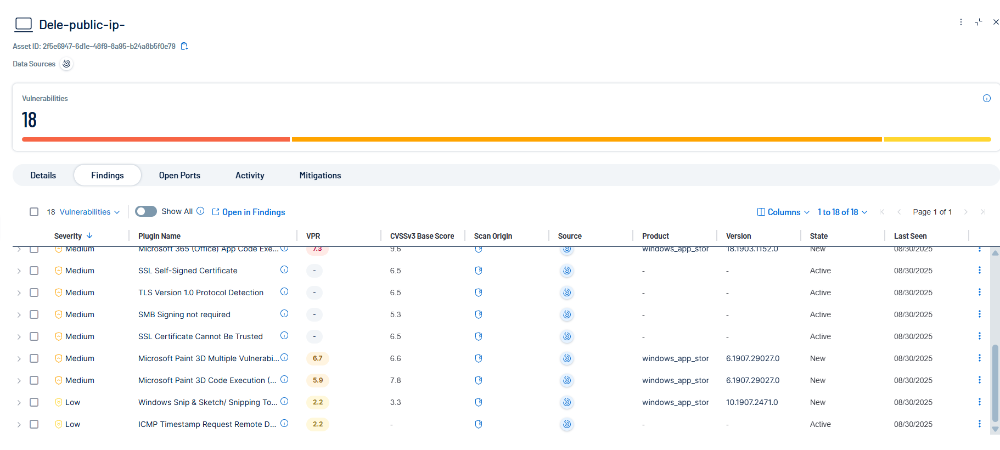
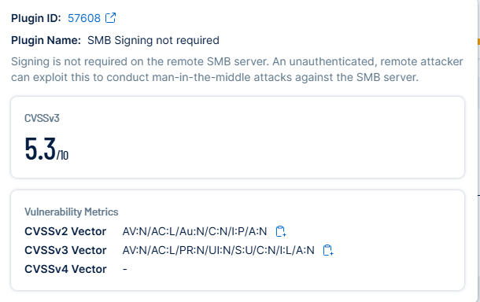

# STIG – SMB Signing Not Required (Plugin ID: 57608)

## Before
- **Finding:** SMB signing is not enabled on the SMB server.  
- **Risk:** Without SMB signing, attackers can perform man-in-the-middle (MITM) attacks and tamper with SMB traffic.  
- **Evidence:**  
    
    

---

## Remediation
1. Open `gpedit.msc` (Local Group Policy Editor).  
2. Navigate to:  
   `Computer Configuration > Windows Settings > Security Settings > Local Policies > Security Options`.  
3. Set the following to **Enabled**:  
   - **Microsoft network client: Digitally sign communications (always)**  
   - **Microsoft network server: Digitally sign communications (always)**  
4. Apply changes and reboot if required.  
5. Rescan in Tenable to confirm remediation.  

---

## After
SMB signing successfully enabled, protecting SMB traffic against MITM attacks.  

Evidence:  
SMBSigning-After-Details.png  
SMBSigning-After-Rescan.png  

